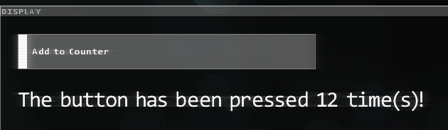

<center>
<h1>Hacknet GUI Basics</h1>
</center>

---

This guide will go over the basics you need to know for handling GUI in Hacknet. For sake of example, we'll be doing everything relating to the GUI in a daemon. For now, we can use the [example daemon](../mod/daemons.md).
```csharp
[Pathfinder.Meta.Load.Daemon]
public class CustomDaemon : Pathfinder.Daemon.BaseDaemon
{
    public CustomDaemon(Computer computer, string serviceName, OS opSystem) : base(computer, serviceName, opSystem) { }

    public override string Identifier => "Custom Daemon";

    public override void draw(Rectangle bounds, SpriteBatch sb)
    {
        base.draw(bounds, sb);
    }
}
```
> ## [!] X/FNA Tip - Drawing Frames   
> FNA's `draw` method runs *every frame*. That means if the game is running at 60fps, then whatever you put in `draw` will fire sixty times every second. If you need to handle logic, it's better to put it in `Update`, but we'll get to that later.

Don't worry about registering the daemon; the class attribute (`Pathfinder.Meta.Load.Daemon`) will do it for us automagically. (That's your word of the day!) Anywho. Now that we've got the daemon set up, let's get started with some basic GUI stuff. Let's draw a square! If you've read the docs, then you'll know we can do this with [RenderedRectangle](../hndocs/gui/Rectangles.md). We'll just be creating a 100x100 rectangle, but there is something we'll need to cover; bounds.

When drawing in a section of the screen, such as a daemon or executable, you'll want to draw inside of its `bounds`. This is basically a [`Rectangle`](https://learn.microsoft.com/en-us/previous-versions/windows/silverlight/dotnet-windows-silverlight/bb198628(v=xnagamestudio.35)) that is fit to where the content should be. You'll want to draw inside these bounds, because Hacknet uses global positioning for drawing stuff. This means, for example, if you want to draw something 10 pixels from the left of a daemon display, you'd need to offset 10 pixels from the daemons `bounds.X`.

## Topic 1: Rectangles
Let's say we want a 100x100 square that's 10 pixels from the top-left of the daemon. How would we do it? Give it a shot yourself; and then come back when you think you've got the answer.

Back? Great! Here's what I did, personally;
```csharp
    public override void draw(Rectangle bounds, SpriteBatch sb)
    {
        base.draw(bounds, sb);

        RenderedRectangle.doRectangle(bounds.X + 10, bounds.Y + 10, 100, 100, Color.White);
    }
```
Yep, it's that easy. Now, when you put this daemon in a node (via `<CustomDaemon/>`), you'll see the rectangle you drew. Doesn't it look beautiful? Oh, also, congratulations! You're a Pathfinder mod developer now! This method is how you'd also draw things in an executable. However, before we give ourselves a pat on the back, we need to remember something! Hacknet is played by many different people, all with different types of screens. In other words, we should also size our stuff dynamically. For this, we can use `bounds.Width` and `bounds.Height`.

In our case, we want to make a square. This means we can use the same value for width and height. Let's use... the bound's height. We don't want the square to be *huge*, so let's get, say, 10% of the height. Again, try this yourself before moving on!
```csharp
    public override void draw(Rectangle bounds, SpriteBatch sb)
    {
        base.draw(bounds, sb);

        RenderedRectangle.doRectangle(bounds.X + 10, bounds.Y + 10, bounds.Height * 0.1f, bounds.Height * 0.1f, Color.White);
    }
```
(**NOTE**: This can also be written as `bounds.Height / 10f`, but either works. I prefer multiplication most of the time, but to each their own.)

Now that we're using percents of the display, this will look the same on all displays, for the most part. If we were to use the bound's width, it wouldn't be a *huge* worry, but it might look too big on ultrawide screens. Anyway, *now* you can pat yourself on the back; your daemon will look almost identical on every display. Hooray for parity!

## Topic 2: Buttons
Now, let's get a tiny bit more advanced, and create a button with a counter. It might be a good idea to clear the `draw` function again; but it's up to you.

[Buttons](../hndocs/gui/Buttons.md) will be very useful to you moving forward; it's basically the main way a user interacts with daemons, and sometimes even executables! We'll be creating an easy button, just one that tracks how many times we've clicked it. We'll also be throwing a dash of [text labels](../hndocs/gui/TextItem.md) in here for good measure. Don't worry - nothing too serious!

I won't explain how buttons work here - [the documentation page linked above](../hndocs/gui/Buttons.md) already does that. I will explain how to place them, though you will soon see it is not all different from how rectangles are placed. Let's create a pretty simple button that's 25 pixels offset from the top-left of the daemon bounds. Feel free to make it however big you want - I'll make mine half of the daemon's width, and 50px high. (Yes, the height is constant, but it's so small; so it's negligible in this context.)

Additionally, we'll be using `PFButton` to get the button ID using `GetNextID`. This is best defined as a class field. (Don't forget to add `using Pathfinder.GUI;` to the top of your code!)
```csharp
    int buttonID = PFButton.GetNextID();

    public override void draw(Rectangle bounds, SpriteBatch sb)
    {
        base.draw(bounds, sb);

        Button.doButton(buttonID, bounds.X + 25, bounds.Y + 25, bounds.Width / 2, 50, "Add to Counter", Color.White);
    }
```
We'll also need to keep track of how many times the button is clicked, so let's define an `int` named `counter` as a class field. Additionally, let's store the button's value as a `bool`. We'll use that to create an `if` statement that will add to `counter` when `true`.
```csharp
    int buttonID = PFButton.GetNextID();
    int counter = 0;

    public override void draw(Rectangle bounds, SpriteBatch sb)
    {
        base.draw(bounds, sb);

        bool buttonPressed = Button.doButton(buttonID, bounds.X + 25, bounds.Y + 25, bounds.Width / 2, 50, "Add to Counter", Color.White);

        if(buttonPressed) {
            counter++;
        }
    }
```
Now, the button will add to the counter variable every time it is clicked. Wunderbar! (That's your German word of the day!) However, we have no way of showing the value of the counter. So, let's create a label that will show the value of counter. I'll be using a [string template](https://learn.microsoft.com/en-us/dotnet/csharp/language-reference/tokens/interpolated) here, but feel free to show it however you like.
```csharp
    int buttonID = PFButton.GetNextID();
    int counter = 0;

    public override void draw(Rectangle bounds, SpriteBatch sb)
    {
        base.draw(bounds, sb);

        Vector2 textPosition = new Vector2(bounds.X + 25, bounds.Y + 100);
        string labelText = $"The button has been pressed {counter} time(s)!";

        bool buttonPressed = Button.doButton(buttonID, bounds.X + 25, bounds.Y + 25, bounds.Width / 2, 50, "Add to Counter", Color.White);
        TextItem.doLabel(textPosition, labelText, Color.White);

        if(buttonPressed) {
            counter++;
        }
    }
```
> ## [!] C# Tip - Interpolating Strings   
> Those coming from other languages might be more familiar with string concatenation. However, generally, string interpolation makes cleaner code. You can learn more about string interpolation in the [Microsoft docs](https://learn.microsoft.com/en-us/dotnet/csharp/language-reference/tokens/interpolated).

When you click the button, you should see the text update in real-time now. The more you click the button, the higher the value gets! Again, buttons can be used in this same manner in executables, as well. Overall, here's what our example daemon looks like:
```csharp
[Pathfinder.Meta.Load.Daemon]
public class CustomDaemon : Pathfinder.Daemon.BaseDaemon
{
    public CustomDaemon(Computer computer, string serviceName, OS opSystem) : base(computer, serviceName, opSystem) { }

    public override string Identifier => "Custom Daemon";

    int buttonID = PFButton.GetNextID();
    int counter = 0;

    public override void draw(Rectangle bounds, SpriteBatch sb)
    {
        base.draw(bounds, sb);
        
        Vector2 textPosition = new Vector2(bounds.X + 25, bounds.Y + 100);
        string labelText = $"The button has been pressed {counter} time(s)!";

        bool buttonPressed = Button.doButton(buttonID, bounds.X + 25, bounds.Y + 25, bounds.Width / 2, 50, "Add to Counter", Color.White);
        TextItem.doLabel(textPosition, labelText, Color.White);

        if(buttonPressed) {
            counter++;
        }
    }
}
```
And the result:   


Congratulations! 🎉 Pat yourself on the back again, you are now familiar with the basics of Hacknet's GUI system. You can only get better from here - the sky's the limit!